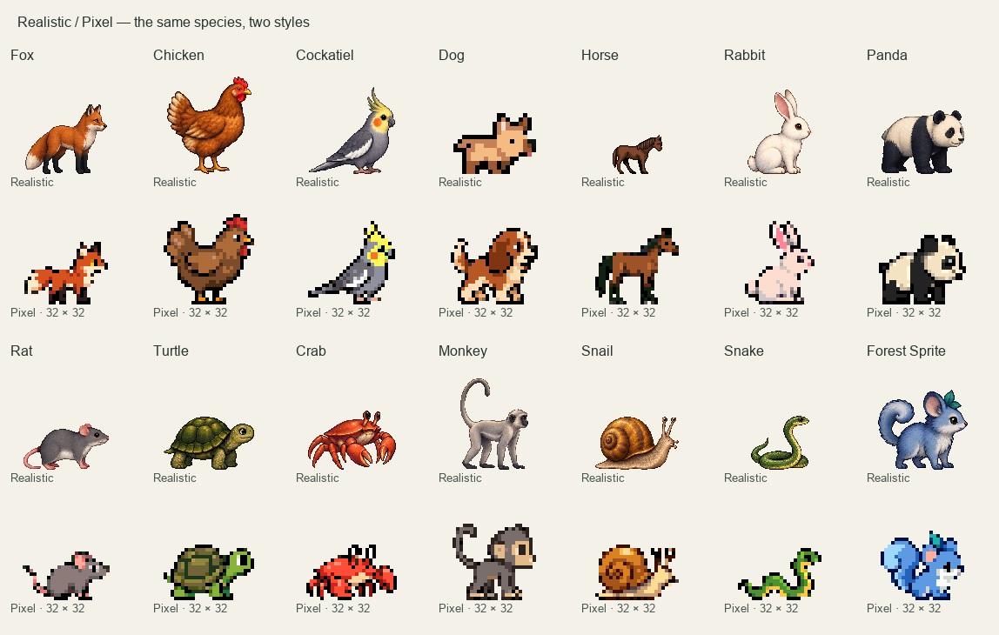

# Pixel animals



These 14 original animal sheets were generated with the built-in OpenAI image
generation tool, using one prompt per species. No API or CLI fallback was used.
Every exact prompt and reviewed pose bound is recorded in `sheets.json` alongside
the PNG sources. All artwork, including the Pixel dog and horse, was newly drawn;
the existing Realistic GIFs were preserved.

The set has one coat per species. Each sheet contains eight poses: idle, blink,
two walking strides, running, greeting, sleeping, and playing with a green ball.
The packager uses a consistent scale and baseline across all poses of an animal,
nearest-neighbor resizing into a 32 × 32 canvas, at most 15 opaque colors shared
across its animations, and binary transparency. The six GIF states per animal
produce 84 files in `Assets/Pixel/`. Only those GIFs are bundled into the app.

To reproduce the GIFs from the checked-in sheets (requires Pillow):

```sh
python3 script/generate_original_sprites.py --style pixel
python3 script/write_asset_manifest.py
./script/test.sh
```

Switching to Pixel changes the rendered coat without changing a pet's stored
Realistic variant. Switching back restores that choice.
