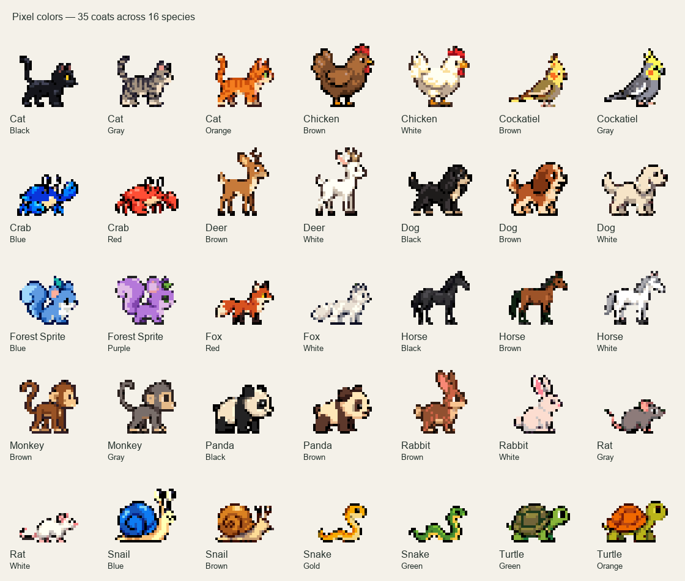

# Pixel animals



These 35 original animal sheets were generated with the built-in OpenAI image
generation tool, using one prompt per coat. No API or CLI fallback was used.
Every exact prompt and reviewed pose bound is recorded in `sheets.json` alongside
the PNG sources. All artwork, including the Pixel dog and horse, was newly drawn;
the existing Realistic GIFs were preserved.

The set has 35 coats across 16 species, with at least two colors per species. Each sheet contains eight poses: idle, blink,
two walking strides, running, greeting, sleeping, and playing with a green ball.
The packager uses a consistent scale and baseline across all poses of an animal,
nearest-neighbor resizing into a 32 × 32 canvas, at most 15 opaque colors shared
across its animations, and binary transparency. The six GIF states per animal
produce 210 files in `Assets/Pixel/`. Only those GIFs are bundled into the app.

To reproduce the GIFs from the checked-in sheets (requires Pillow):

```sh
python3 script/generate_original_sprites.py --style pixel
python3 script/write_asset_manifest.py
./script/test.sh
```

Switching styles preserves each pet's stored coat. If that coat is unavailable
in the selected style, the first available coat is displayed until switching back.

| Species | Pixel colors |
| --- | --- |
| Cat | Orange, gray, black |
| Chicken | Brown, white |
| Cockatiel | Gray, brown |
| Crab | Red, blue |
| Deer | Brown, white |
| Dog | Brown, black, white |
| Fox | Red, white |
| Horse | Brown, black, white |
| Monkey | Gray, brown |
| Panda | Black, brown |
| Rat | Gray, white |
| Snail | Brown, blue |
| Snake | Green, gold |
| Turtle | Green, orange |
| Rabbit | White, brown |
| Forest sprite | Blue, purple |
