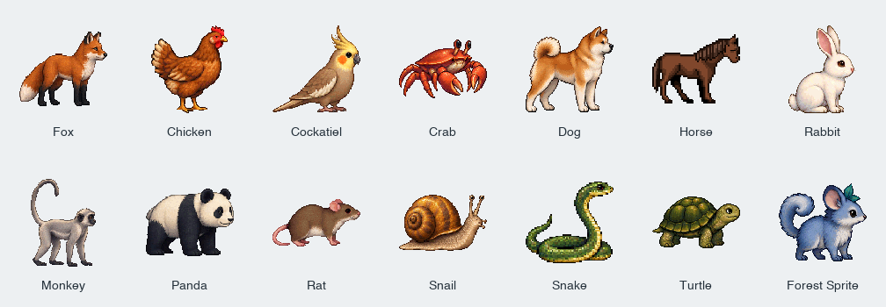

# Realistic and Pixel animal artwork



The original sheets in this folder were created with the built-in OpenAI image
generation tool. `sheets.json` contains every exact prompt, file name, species,
variant order, and reviewed pixel bounds for the eight poses. No API/CLI fallback
was used. These source sheets are project assets; only the GIFs in `Assets/` are
included in the app bundle.

The existing 35 variants are classified as **Realistic**. The new **Pixel** set
has one original variant for every species. Its 14 source sheets, exact prompts,
reviewed frame bounds, and a comparison preview are in [Pixel/](Pixel/README.md).
Pixel GIFs are packaged into `Assets/Pixel/` with 32 × 32 frames, a two-pixel margin,
at most 15 opaque colors per animal, binary transparency, and no dithering.
Both styles use nearest-neighbor scaling in the app.

The visual reference was https://virtuall.pro/blog/pixel-art-animals. Its emphasis
on recognizable silhouettes, animal anatomy, purposeful palettes, and consistent
shading guided the new drawings. No artwork from that page was copied.

The poses are idle, blink, two walking steps, running, greeting, sleeping, and
playing with a ball. The packager gives all eight poses of each animal one scale
and a common baseline, preserves aspect ratio, and places them in 128 px canvases.
The shared palette uses maximum coverage to preserve small colored details such
as the green ball. GIFs use a reserved transparent index and no dithering.

Regenerate either original set with Pillow installed:

```sh
python3 script/generate_original_sprites.py --style realistic # 120 GIFs
python3 script/generate_original_sprites.py --style pixel     # 84 GIFs
python3 script/write_asset_manifest.py
./script/test.sh
```

The 66 horse GIFs come from Onfe's artwork, adapted by Chris Kent in VS Code Pets
at commit `2c91214beb922288cca1938cddb607abc5f806b7`; they retain the supplied 80 × 64
pixel frames and animations. The horse rests using the standing animation. See
`Assets/horse/license.txt` and `Assets/manifest.json` for credit and exact sources.
Four dog color sets also retain their original GIF bytes and separate license.
The packager never overwrites those third-party assets.
